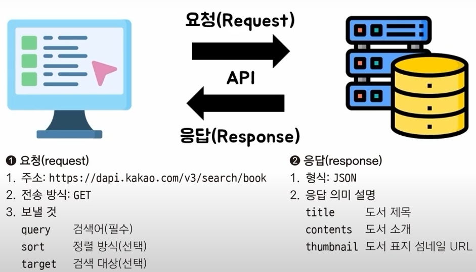

## 1. API
1.1. 개요.
* API, Application Programming Interface는 소프트웨어 애플리케이션 간 상호 작용을 가능하게 하는 인터페이스로, API는 프로그램이나 서비스가 다른 프로그램의 기능을 사용할 수 있도록 규칙과 명령어를 정의해, 서로 다른 시스템이 데이터와 기능을 공유할 수 있게 함.
* 앱이 프로그래밍 언어로 상호작용할 때의 규칙

1.2. API 가이드 요청과 응답의 규칙

* 요청과 응답 규칙(API 가이드)에 맞춰서 API를 사용한다.
* 요청
> * 주소: 벡엔드 주소에 대한 정보
> * 전송방식: GET(URL에 넣어서), POST(별도의 안보이는 공간에 넣어서)
* 응답
> * 형식: JSON(대부분 JSON 사용)

 

1.3 주요 개념
* __인터페이스(Interface)__: 상호간에 소통을 위해 만들어진 접점으로, 한 프로그램이 다른 프로그램의 기능이나 데이터를 사용할 수 있도록 규칙과 프로토콜을 제공하는 것.
* __앤드포인트(Endpoint)__: API가 제공하는 특정 기능에 접근하기 위한 URL로, 예를 들어, 사용자 정보를 가져오는 엔드포인트는 `https://api.example.com/users`와 같은 형태를 가질 수 있음.
* __요청(Request)와 응답(Response)__: API는 클라이언트와 서버 간 통신을 통해 작동. 클라이언트가 서버에 요청을 보내면, 서버는 해당 요청을 처리하고 응답을 반환함. 요청은 주로 HTTP 메소드 (GET, POST, PUT, DELETE 등)를 사용하여 이루어지며, 응답은 요청에 대한 결과를 포함.
* __API의 구조__
> * 요청: 프론트엔드(화면)에서 정보를 요청을 보낸다.
> * 응답: 백엔드(데이터처리)에서 정보 처리 및 결과를 도출해 응답을 보낸다.
> * 데이터 포맷: API는 주로 JSON(JavaScript Object Notation)이나 XML(eXtensible Markup Language) 형식으로 데이터를 주고받음. JSON은 가볍고 읽기 쉬운 구조로 인해 널리 사용됨.

 

1.4 API의 활용 예시
* __소셜 미디어 통합__: 애플리케이션에서 페이스북이나 트위터의 API를 사용하여 사용자 프로필 정보나 게시물을 가져오거나, 새로운 콘텐츠를 게시할 수 있습니다.
* __지도 서비스__: 구글 지도 API를 활용하여 애플리케이션 내 지도를 표시하고, 경로 안내나 장소 검색 기능 구현 가능
* __결제 시스템__: 페이팔이나 스트라이프와 같은 결제 서비스의 API를 통해 애플리케이션에 결제 기능을 통합할 수 있음.

 

1.5 API의 장점
* __재사용성__: 한 번 개발된 기능을 여러 애플리케이션에서 재사용할 수 있어 개발 효율이 높아짐.
* __유연성__: 다양한 플랫폼과 언어에서 API를 활용하여 기능을 구현할 수 있음.
* __보안성__: API를 통해 데이터 접근을 제어하고, 인증 및 권한 관리를 통해 보안을 강화할 수 있음.

 
 

## 2. 통신 프로토콜 및 아키텍처 스카일에 따른 API
2.1. HTTP API
* HTTP(HyperText Transfer Protocol)를 기반으로 애플리케이션 간 데이터를 주고받는 인터페이스로, 웹의 기본 프로토콜인 HTTP를 사용하여 클라이언트와 서버 간 통신을 수행.
* 특징
> * 프로토콜 기반: HTTP의 표준 메서드(GET, POST, PUT, DELETE 등)를 활용하여 자원에 대한 다양한 작업 수행
> * URI를 통한 자원 식별: 각 자원은 고유한 URI를 통해 식별되며, 이를 통해 특정 자원에 접근하거나 조작 가능.
> * 다양한 데이터 형식 지원: JSON, XML, HTML 등 다양한 형식의 데이터를 주고받을 수 있어서 유연성이 높음.
* 장점
> * 광범위한 호환성: HTTP는 웹의 기본 프로토콜이므로, 다양한 플랫폼과 언어에서 쉽게 구현하고 사용할 수 있음.
> * 방화벽 친화적: HTTP는 일반적으로 방화벽에서 허용되므로, 네트워크 제약이 있는 환경에서도 활용하기 용이함.
> * 캐싱 기능 활용: HTTP의 캐싱 메커니즘을 통해 응답 데이터를 효율적으로 관리하고, 성능을 향상시킬 수 있음.
* 단점
> * 보안 이슈: HTTP는 기본적으로 암호화되지 않으므로, HTTPS를 사용하여 보안을 강화해야 함.
>> * HTTPS를 사용하여 데이터 전송을 암호화하여 보안을 강화할 수 있고, 인증 및 권한 부여 메커니즘을 통해 보안 수준을 높일 수 있음.
> * 상태 비저장: 각 요청이 독립적으로 처리되므로, 상태를 유지해야 하는 애플리케이션에서는 추가적인 구현이 필요
>> * HTTP의 무상태성은 서버의 확장성과 단순성을 높이는 장점이 있으나, 상태를 유지해야 하는 애플리케이션에서는 세션 관리나 토큰 기반 인증 등의 추가적인 구현 필요.

 

2.2. REST API (Representational State Transfer)
* 웹 서비스 설계의 아키텍처 스타일 중 하나로 HTTP 프로토콜을 기반으로, 자원(Resource)을 URI로 식별하고, HTTP 메서드를 통해 자원에 대한 CRUD(Create, Read, Update, Delete) 작업 수행
* 특징
> * 무상태성(Stateless): 서버는 클라이언트 상태를 저장하지 않으며, 각 요청은 독립적으로 처리됨.
> * 캐시 처리 가능(Cacheable): 응답 데이터는 캐시가 가능해야 하며, 이를 통해 클라이언트는 서버와의 트래픽을 줄이고 성능 향상 가능.
> * 계층화 시스템(Layerd System): 클라이언트는 중간 서버(프록시, 게이트웨이 등)을 통해 서버에 접근할 수 있으며, 각 계층은 독립적으로 동작
* 장점
> * 단순하고 직관적인 설계: HTTP 프로토콜을 기반으로 하여 이해와 구현이 용이
> * 캐싱을 통한 성능 향상: HTTP의 캐싱 기능을 활용하여 응답 속도를 높일 수 있음.
> * 유연성과 확장성: 다양한 데이터 형식을 지원하며, 시스템 확장에 유리
* 단점
> * 복잡한 데이터 처리의 한계: 복잡한 관계의 데이터를 처리할 때 여러 번의 요청이 필요하여 비효율적일 수 있음.
> * 표준의 부재: 명확한 표준이 없어 구현 방식에 따라 일관성이 떨어질 수 있음.
>> * 아키텍처 스타일로서 명확한 표준이 없으나, 이를 보완하기 위해 OpenAPI 같은 명세를 활용하여 API의 일관성과 문서화를 강화할 수 있음.
> * 오버페칭(over-fetching) 문제: 클라이언트가 필요로 하는 데이터보다 더 많은 데이터를 수신하는 문제
> * 언더페칭(under-fetching) 문제: 복잡한 데이터 구조 처리 시, 여러 엔드포인트를 호출해야 할 수 있음.
>> * 오버페칭 및 언더페칭 문제 해결을 위해 GraphQL과 같은 대안적인 API 설계 고려 가능.

 

2.3. SOAP API (Simple Object Access Protocol)
* XML 기반의 메시지 프로토콜로, HTTP, SMTP 등 다양한 프로토콜을 통해 통신할 수 있음.
* 특징
> * 염격한 표준과 규격: XML 기반의 메시지 프로토콜로, 정해진 스펙에 따라 메시지 구조와 처리 방식을 정의하여 상호 운용성이 높음
> * 보안성과 신뢰성: WS-Security와 같은 표준을 통해 보안 기능을 제공하며, 트랜잭션 관리 등 신뢰성이 요구되는 환경에 적합.
> * 복잡한 메시지 구조: XML을 사용하여 메시지 구조가 복잡하고 무거워 성능이 저하될 수 있음.
> * 상태 유지(stateful)와 상태 비저장(stateless) 통신 모두 지원: SOAP는 상태를 유지하거나 비저장 상태로 통신할 수 있어, 다양한 요구사항에 대응 가능.
* 장점
> * 높은 보안성과 신뢰성: WS-Security와 같은 표준을 통해 보안 기능을 제공하며, 트랜잭션 관리 등 신뢰성이 요구되는 환경에 적합
> * 표준화된 프로토콜: 엄격한 표준과 규격을 따르므로, 상호 운용성이 높음.
> * 다양한 프로토콜 지원: HTTP뿐만 아니라 SMTP 등 다양한 프로토콜을 통해 통신 가능.
> * 보안성과 신뢰성이 높아 금융, 통신 등 보안이 중요한 분야에서 사용.
* 단점
> * 복잡한 메시지 구조: XML을 사용하여 메시지 구조가 복잡하고 무거워 성능이 저하될 수 있음. XML 형식만을 사용하여 데이터 처리가 비효율적일 수 있음.
>> * 이를 보완하기 위해 메시지 크기를 최적화하거나, 필요한 경우 RESTful API와 같은 대안 고려 가능
> * 구현의 복잡성: 엄격한 스펙으로 인해 구현과 유지보수가 어려움.
>> * 이를 해결하기 위해 WSDL(Web Service Description Language) 같은 도구를 활용해 서비스 정의를 자동화하고, 개발 프레임워크를 통해 복잡성을 줄일 수 있음.

 

2.4. GraphQL API
* 페이스북에서 개발한 데이터 쿼리 언어로, 클라이언트가 필요한 데이터의 구조를 쿼리로 정의하여 요청할 수 있음.
* 특징
> * 단일 엔드포인트: 모든 요청을 단일 엔드포인트를 통해 처리하여 관리가 용이.
> * 강력한 타입시스템: 스키마를 통해 데이터 구조를 명확하게 정의하여, 클라이언트와 서버 간 계약을 명확히 함.
> * 오버패칭과 언더페칭 해결: 클라이언트가 필요한 데이터만 선택적으로 요청할 수 있어 효율적인 데이터 전송 가능
* 장점
> * 효율적인 데이터 페칭: 클라이언트가 필요한 데이터만 선택적으로 요청할 수 있어 오버페칭과 언더페칭 문제를 해결한 효율적인 데이터 전송이 가능
> * 단일 엔드포인트: 모든 요청을 단일 엔드포인트를 통해 처리하여 관리가 용이함.
> * 강력한 타입 시스템: 스키마를 통해 데이터 구조를 명확하게 정의하여, 클라이언트와 서버 간 계약을 명확히 함.
> * 유연성: 클라이언트가 필요한 데이터만 선택적으로 요청할 수 있어 유연성이 높음.
* 단점
> * 복잡한 쿼리 처리: 서버 측에서 복잡한 쿼리를 처리할 때 성능 이슈가 발생할 수 있음
>> * 쿼리 복잡성을 제한하거나 최적화 전략을 도입해 성능 개선 가능
> * 캐싱의 어려움: REST에 비해 캐싱 구현이 복잡하여, 성능 최적화에 추가적인 노력이 필요.
>> * GraphQL의 유연성으로 인해 캐싱이 복잡할 수 있으므로, 캐싱 전략을 신중하게 설계하고, 필요한 경우 캐싱 라이브러리나 도구를 활용하여 성능 최적화 가능
> * 학습 곡선: 기존 RESTful API에 익숙한 개발자에게는 새로운 학습 필요

| 특성 | REST API | SOAP API | GraphQL API |
|----|----|----|----|
|데이터 형식|주로 JSON, XML 등 다양한 형식 지원|XML 형식 사용|JSON 형식 사용|
|보안|HTTPS를 통한 전송 보안|WS-Security를 통한 높은 보안 수준|HTTPS를 통한 전송 보안|
|유연성|고정된 엔드포인트와 데이터 구조|엄격한 표준과 규격으로 유연성 낮음|클라이언트가 데이터 구조를 정의하여 높은 유연성|
|성능|경량 프로토콜로 비교적 우수|무거운 메시지 구조로 성능 저하 가능|복잡한 쿼리 처리 시 성능 이슈 발생 가능|

