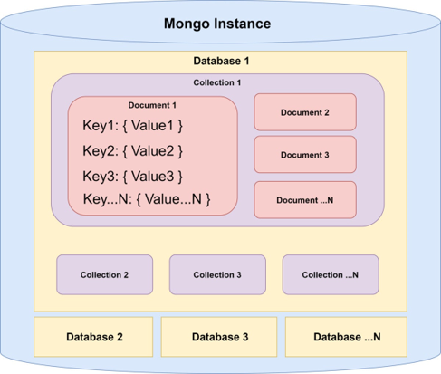
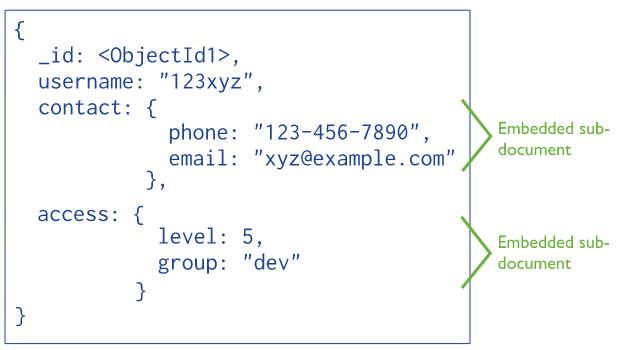

# MongoDB

## __1. MongoDB의 개요__
__1.1. MongoDB를 포함한 NoSQL의 장점__
* 불필요한 Join의 최소화
* 유연성 있는 서버 구조 제공
* 비정형 데이터 구조로 설계 비용 감소
* Read/Write가 빠르며 빅데이터 처리 가능
> * 일반적인 관계영 DB가 빠른 경우도 있음
* 저렴한 비용으로 분산처리 및 병렬처리 가능
> * 비정형 데이터로 인해 관계형 DB보다 1.5배 용량을 더 많이 차지

<br>
<br>

__1.2. NoSQL의 종류__
* Key-Value: Redis, Memcached
* Column: Hbase, Casandra
* Document: MongoDB
* Graph: GraphDB

|Relation DB|NoSQL|
|----|----|
|Scalue-up: 서버 한대 중심으로 확장|Scale-out: 여러 대의 서버를 중심으로 확장|
|무결성|유연성|
|데이터 중복 제거|데이터 중복 허용|
|트랜잭션|빠른 쓰기, 읽기|

<br>
<br>

__1.3. MongoDB의 특징__
* MongoDB는 NoSQL로 분류되는 크로스 플랫폼 도큐먼트 지향 데이터베이스 시스템이다.
* 이름의 Mongo는 humongous의 줄인 말로, "엄청나게 큰 DB"라는 뜻이다.
* Json 타입의 Document 방식의 NoSQL이다.
> * Json 형식의 데이터 구조(MongoDB는 이를 BSON이라 부른다)
> * CRUD 위주의 다중 트랜잭션 처리 가능
> * Sharding(분산) / Replica(복제) 기능 제공
> * Memory Mapping 기술을 기반으로 빅데이터 처리 성능 탁월
* 똑같은 조건으로 설계 시, 기존 RDBMS보다 굉장히 빠름
> * 일반적인 RDBMS는 데이터의 중복을 제거하고, 무결성을 보장하기 위해 정규화하는데, 이러한 정규화로 인해 과도한 Join이 발생하여 성능 저하가 발생할 수 있음
> * MongoDB의 빠른 속도는 ACID를 포기한 댓가로 얻은 것으로, 데이터 일관성(Consistency)가 거의 필요 없고, Join 연산을 Embed로 대체할 수 있는 경우에는 MongoDB가 확실한 대안이 될 수 있음
> * 이러한 유연함은 개발자에게 스키마 팽창을 피해야한다는 부담을 의미하기도 하므로, 대규모 앱에서는 문서 구조에 대한 통제력을 유지하는 것이 중요
> * 그러나, 저장하는 데이터가 은행 데이터 같이 일관성(Consistency)이 매우 중요한 경우, MongoDB를 쓰기 매우 힘들다

<br>
<br>

__1.4. MongoDB의 구조__
* 관계형 DB와 MongoDB의 논리적 구조 비교

|Relational Database|MongoDB|
|----|----|
|Table|Collection|
|Row|Document|
|Column|Field|
|Primary key|Object_ID Field|
|Relationship|Embbeded & Link|
* MongoDB의 문서(Document)는 key-value의 집합으로 그 동작 방식은 객체와 매우 비슷함
* MongoDB의 구조
> * DB > Collection > Document
* __Document__: 가장 기본적인 데이터를 Document라 부르며, 이는 MySQL과 같은 RDBMS의 Row에 해당
> * Document의 최대 크기는 16MB
* __Collection__: Document의 집합으로, Collection은 RDBMS의 테이블에 해당함
> * Collection의 수가 많다고, 크게 성능 저하를 발생시키지는 않지만, 동일한 컬렉션 안에 많은 항목이 있다면, 성능에 영향을 줄 수 있음
> * 때문에 크기가 큰 컬렉션을 소모하기 쉬운 크기로 쪼갤 수 있는 방법을 고려해야함
* __DB__: Collection의 집합



<br>
<br>

__1.5. MongoDB의 ID 필드__
* 관계형 DB의 기본 키(Primary key) 개념은, 합성 ID 열, 즉 비즈니스 데이터와 관계되지 않고 생성된 값임
* MongoDB는 비슷한 목적으로 모든 Document에 *_id* 필드가 있음
* 개발자가 Document를 만들 때, ID를 별도로 제공하지 않는 경우, MongoDB 엔진이 UUID로 자동 생성
* *_id* 필드는 기본 키와 마찬가지로 자동으로 인덱싱되며, 고유해야함

<br>
<br>

__1.6. MongoDB의 인덱싱__
* MongoDB의 인덱싱은 관계형 DB의 인덱싱과 유사
* 문서의 필드에 대한 부가적인 데이터를 생성해 이 필드에 의존하는 조회의 속도를 높임
* MongoDB는 B-Tree 인덱스 사용
* 인덱스는 다음과 같은 구문으로 만들 수 있음
> * `db.pet.createIndex({name:1})
> * 매개변수의 정수는 인덱스가 오름차순(1)인지 내림차순(-1)인지 나타냄

<br>
<br>

__1.7. MongoDB의 중첩 문서__



* MongoDB의 문서 지향 구조가 갖는 강력한 장점은 Document를 중첩할 수 있다는 것
* 예를 들어, 다음 예제와 같이 반려 동물 Document에 주소 정보를 저장할 또 다른 Field를 만드는 대신 중첩 Document를 만들 수 있음
```json
{
  "_id": "5cf0029caff5056591b0ce7d",
  "name": "Friar Tuck",
  "address": {
    "street": "Feline Lane",
    "city": "Big Sur",
    "state": "CA",
    "zip": "93920"
  },
  "type": "cat"
}
```

<br>
<br>
<br>
<br>

## __2. Docker로 MongoDB 설치하기__

__2.1. MongoDB 이미지 설치__
* docker 설치 및 환경 구축 생략
* docker pull로 최신 mongoDB 이미지를 다운로드
> * `$ docker pull mongo`
* MongoDB docker 컨테이너 생성 및 실행

``` bash
docker run \
  --name mongodb \
  -d \
  -p 27017:27017 \
  -v /data4/MongoDB:/data/db \
  -e MONGO_INITDB_ROOT_USERNAME=root \
  -e MONGO_INITDB_ROOT_PASSWORD=myPassword \
  mongo
```

<br>
<br>

__2.2. MongoDB에 유저 추가하기__
* MongoDB Docker 컨테이너 접속
> * `docker exec -it mongodb /bin/bash`
* MongoDB root 계정으로 DB 접속
> * `mongo -u root -p myPassword`
* admin 위치에 생성
> * `use admin`
* 관리자 계정 생성
> * 모든 DB의 관리자 권한을 갖는 계정 추가

```bash
$ mongo
  \> db.createUser({
      user: "admin",
      pwd: "AjouCancer21!",
      roles: [{
        role: "userAdminAnyDatabase",
        db: "admin"
      }]
     })
```
* 읽기와 쓰기만 가능한 이용자 계정 추가 방법
```bash
$ mongo
  \> db.createUser({
      user: "user0",
      pwd: "user0",
      roles: [{
        role: "readWrite",
        db: "dbname"
      }]
    })
```
* 읽기만 가능한 이용자 계정 추가 방법
```bash
$ mongo
  \> db.createUser({
      user: "user1",
      pwd: "user1",
      roles: [{
        role: "read",
        db: "dbname"
      }]
    })
```
* 생성한 유저 목록은 use admin 상태에서 `show users`를 하면 볼 수 있음
* DB 현황은 `show dbs`를 하면 볼 수 있음
* 생성된 유저 목록은 admin DB에 생성되므로, 컨테이너를 제거해도 서버에 연결된 공간에 정보가 남아 있음

<br>
<br>
<br>
<br>

## __3. 기본적인 MongoDB 문법__

__3.1. MongoDB 연결__
* python에서 MongoDB 조작

```python
import pymongo

# MongoDB 연결은 Host IP와 Port 번호만 있으면 접속 가능
conn = pymongo.MongoClient(HOST_IP, PORT)

# Auth가 설정되지 않은 상태에서 접속 방법
conn = pymongo.MongoClient(f"mongodb://{HOST_IP}:{PORT}")

# Auth가 설정된 상태에서 접속 방법
conn = pymongo.MongoClient(f"mongodb://{USER_ID}:{PASSWORD}@{HOST_IP}:{PORT}")

# MongoDB 연결 해제
conn.close()
```

* MongoDB의 보안
> * MongoDB는 기본적으로 보안 관련 설정이 없으므로 Auth 설정을 하지 않으면, 단순히 위 방법만으로 설정 가능
> * 그러나, 추후 보안을 위해 MongoDB에 Auth 설정을 한다면 다른 방식으로 해야함.

<br>
<br>

__3.2. DB, Collection, Document 조회__
* DB 조작
```python
# MongoDB의 목록 조회
conn.list_database_names()

# DB 연결(존재하지 않는 경우 생성)
db = conn.DB_name                  # 속성 접근 방식
db = conn.get_database("DB_name")  # 메서드 접근 방식

# DB 제거
conn.drop_database("DB")
```
<br>

* Collection 조작
```python
# DB내 Collection 목록 조회
db.list_collection_names()

# Collection 연결(존재하지 않는 경우 생성)
col = db.Collection_name                      # 속성 접근 방식
col = conn.get_collection("Collection_name")  # 메서드 접근 방식

# Collection 제거
# 특정 Collection 제거
db.drop_collection("Collection_name")
# 해당 Collection 제거
col.drop()
```

<br>

* Document 조작
> * Mongo Object는 Iterator 처럼 next나 for로 값을 순서대로 꺼내올 수 있음
```python
# Collection 내 모든 Document 조회
mongo_object = collection.find({})

# Collection 내 특정 Field에 해당 값을 가진 Document만 조회
mongo_object = collenction.find({"field1":"value1"})

# Collection 내 특정 Field에 해당하는 값을 가진 Document에서 특정 Field 값만 조회
mongo_object = collection.find({"field1":"value1"}, {"field2":"value2"})

# 연속형 데이터를 범위 설정하여 조회
mongo_object = Collection.find({"field1":"value", "integer_field":{"$gt":150, "$lte":200}})

# Collection에 Document 추가
col.insert_one(Document)

# 조건에 맞는 Document 제거
col.delete_one({"field1":"value1"})      # 위에서부터 하나씩 제거
col.delete_many({"field1":"value1"})     # 해당 Document를 한번에 모두 제거
```

<br>
<br>
<br>
<br>

## __4. 고차원 Numpy Array 저장__

__4.1. Bytes object로 저장__
* MongoDB는 숫자형 타입에 대해 int32, int64, float64, float128을 지원하며, 기본으로 int64로 저장
* 이미지 데이터 같은 고차원 array는 MongoDB에 저장이 어려우며 이를 list로 저장하는 경우, int64로 저장되므로 용량이 지나치게 큼
* 데이터 크기를 최적화한 Python 객체를 그대로 MongoDB에 업로드하고자 하는 경우, 이 Python 객체를 Pickle을 이용해 직렬화하여 Bytes 객체로 저장하고, 이를 BSON의 Binary 기능으로 이진화하여 MongoDB에 업로드 시, 데이터 전송 속도를 매우 빠르게 할 수 있음
```python
import bson
import pickle

# 1. Python 객체를 Bytes 객체로 변환
bytes_object = pickle.dumps(data, protocol=5)    # python 3.8은 protocol 5

# 2. Bytes 객체 이진화
bson.binary.Binary(bytes_object)

# Bytes 객체 Python 객체로 원상 복구
pickle.loads(bytes_object)
```
