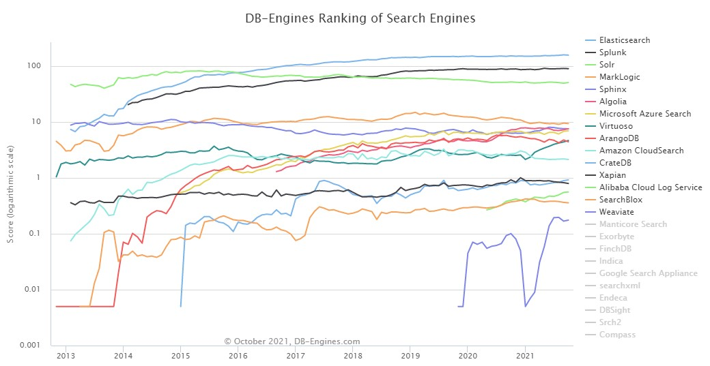
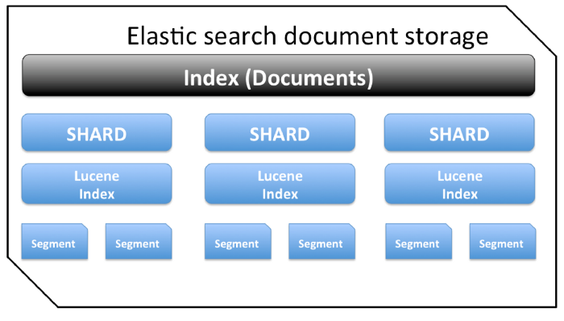
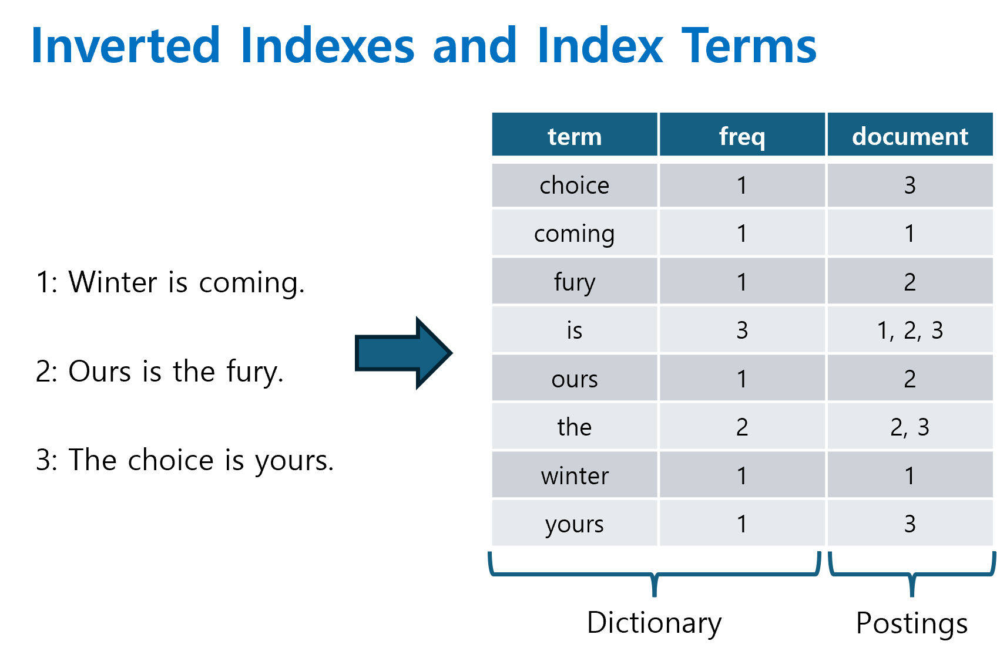

# Elastic Search

### __1. 소개__
* 엘라스틱(Elastic)사에서 아파치 루씬(Apache Lucene)을 기반으로 개발, 공급하는 오픈소스 검색엔진 솔루션
* 엘라스틱 서치는 루씬의 기능을 대부분 지원하면서 대용량 데이터 처리가 가능하고 설치와 구성이 용이함
* 엘라스틱 서치는 2016년 무렵부터 검색 엔진 순위 트랜드 1위를 하고 있을 정도로 많이 사용
> * 출처: https://db-engines.com/en/ranking_trend/search+engine

 

1.1. 아파치 루씬이란?
* 모든 검색엔진의 시초로, 자바로 이루어진 정보 검색 라이브러리 자유-오픈 소스 소프트웨어
* 전문 검색(Full text) 색인 및 검색 기능을 필요로 하는 모든 응용 프로그램에 적합하며, 특히 웹 검색 엔진 및 로컬 단일 사이트 검색 구현에서의 유용성으로 널리 알려짐
* 추천 시스템 구현에 사용되며, 루씬의 "MoreLikeThis" 클래스는 유사한 문서에 대한 추천 생성 가능
* 루씬은 PDF, HTML, MS 워드, 마인드맵 등 텍스트 정보를 추출할 수 있다면 색인을 생성할 수 있음
* 루씬은 강력한 검색 기능을 탑재하고 있으나, 라이브러리 형태로 제공하므로 실제 적용 시 많은 부분을 직접 개발해야함
* 추가적인 개발을 통해 자바 이외에 C++, Python, Ruby 등 다른 프로그래밍 언어를 사용할 수 있도록 변경됨

 
 
 
 

### __2. 개요__
* __문서 검색 및 실시간 처리__
> * 엘라스틱서치는 다양한 문서 형식을 처리하며, 빠른 검색 속도와 실시간에 가까운 검색 제공
> * 다양한 문서를 자동으로 색인 및 검색할 수 있으며, HTTP 기반의 RESTful API를 지원하여 요청/응답에 JSON 형식 사용
> * 로그 분석, 검색 엔진, 데이터 시각화 등 다양한 분야에서 활용 가능
* __멀티테넌시 지원__
> * 엘라스틱서치는 하나의 인스턴스에서 여러 인덱스를 관리할 수 있으며, 이를 통해 서로 다른 사용자나 조직(테넌트)의 데이터를 분리하여 저장하고 관리할 수 있음
> * 이러한 기능을 통해 여러 인덱스를 한꺼번에 묶어 검색할 수 있는 멀티테넌시 지원
* __분산 아키텍처__
> * 엘라스틱서치는 데이터를 분산 처리하며, 인덱스를 여러 샤드로 나누고 이를 클러스터 내의 노드에 분배
> * 이를 통해 고가용성과 확장성 보장
> * 자동 리밸런싱 및 라우팅 기능은 데이터 관리의 편의성을 높여줌
* __인덱스와 샤드 관리__
> * 인덱스 생성 시 프라이머리 샤드 수를 설정해야 하며, 이후에는 변경 불가능
> * 복제 샤드(Replica)는 고가용상을 위해 사용되며, 데이터 손실 위험을 줄이고 읽기 성능을 향상시킴
* __NoSQL 특성__
> * 실시간 GET 요청을 지원하여 데이터 검색에 강점을 보이지만, 분산 트랜잭션 면에서는 제약이 있음

 

__2.1. 멀티테넌시(Multitenancy)__
* 멀티테넌시는 하나의 엘라스틱서치 인스턴스를 여러 사용자 또는 조직이 공유하면서도 데이터와 설정을 독립적으로 관리할 수 있는 기능
* 장점
> * __인프라 자원 효율화__: 여러 테넌트가 하나의 인스턴스를 공유하여 리소스 낭비를 줄일 수 있음
> * __데이터 격리 및 보안__: 각 테넌트의 데이터가 독립적으로 저장되므로 데이터 보안이 강화됨
* 방법
> * __테넌트별 인덱스 분리__
>> * 각 테넌트가 별도의 인덱스를 생성하여 데이터 관리
>> * 데이터 격리와 관리가 용이하지만, 인덱스 및 샤드 수 증가로 인해 시스템 자원 부담이 증가할 수 있음
> * __공유 인덱스 내 데이터 분리__
>> * 하나의 인덱스를 공유하며 테넌트 식별자를 통해 데이터를 분리
>> * 리소스 효율성은 높지만, 데이터 접근 제어와 쿼리 필터링이 필요

 

__2.2. 샤드(Shard)__
* 데이터베이스를 수평으로 분할한 개별 파티션으로, 데이터를 효율적으로 저장하고 분산 처리할 수 있도록 설계된 구조
* RDBMS의 파티션 개념과 유사
* 샤드의 역할
> * 각 샤드는 독립적으로 저장, 검색, 복제를 수행하며, 데이터 부하를 분산시킴
> * 샤드는 클러스터 내의 다양한 노드에 분산되어 고가용성 제공

 

__2.2.1. 샤딩(Sharding)__
* 동일한 데이터 스키마를 가진 데이터를 여러 데이터베이스에 분산 저장하는 방법
* 평적 파티셔닝(Horizontal Partitioning)이라고도 함
* 데이터가 고르게 분산되도록 설계하는 것이 중요하며, 샤딩은 가능한 피하거나 필요한 시점에 적절히 적용해야 함
* 장점
> * 데이터 분산을 통해 성능을 향상시키고, 큰 데이터셋을 효과적으로 처리
* 단점
> * 샤딩은 운영 및 개발 복잡도를 증가시킴
> * 데이터 분산이 잘못되거나 불균형한 경우 핫스팟(Hotspot) 문제가 발생하여 성능 저하를 초래

 

__2.3. 활용 사례__
* 로그 및 지표 분석: 시스템 로그, 웹 로그 등 대량의 로그 데이터를 실시간으로 수집, 분석, 모니터링하는 데 사용
* 사이트 검색: 웹 사이트나 애플리케이션 내에서 사용자가 원하는 정보를 빠르게 찾을 수 있도록 도와
* 데이터 분석: 비즈니스 인텔리전스, 시장 분석 등 다양한 데이터 분석 작업에 활용
* 보안 정보 및 이벤트 관리(SIEM): 보안 이벤트를 실시간으로 모니터링하고 분석하여 잠재적인 위협 탐지
* 애플리케이션 성능 모니터링(APM): 애플리케이션의 성능 데이터를 수집하고 분석하여 성능 최적화에 활용
* 전자상거래: 제품 검색, 추천 시스템 등에 활용되어 사용자 경험 향상

 

__2.4. 엘라스틱서치의 특징__
* __오픈 소스 기반__: 엘라스틱서치는 아파치 루씬(Apache Lucene)을 기반으로 한 오픈 소스 분산 검색 엔진으로, 자바로 개발되었으며 아파치 라이선스 2.0 하에 배포됨
* __RESTful API 지원__: HTTP 기반의 RESTful API를 통해 다양한 프로그래밍 언어와 플랫폼에서 쉽게 통합 및 활용 가능
* __확장성과 가용성__: 분산 아키텍처를 통해 수평적 확장이 용이하며, 데이터 복제를 통해 고가용성 보장
* __강력한 검색 및 분석 기능__: 전문 검색(Full-text search)과 실시간 데이터 분석을 지원하여 다양한 사용 사례에 적용될 수 있음

 

__2.5. 엘라스틱 스택(Elastic Stack)__

* 엘라스틱서치는 데이터 수집, 처리, 저장, 분석, 시각화를 위한 통합 솔루션인 엘라스틱 스택(Elastic Stack)의 핵심 구성 요소
* 엘라스틱 스택은 다음과 같은 구성 요소로 이루어져 있습니다:
> * Beats & Logstash: 데이터 수집 및 가공 담당
> * Elasticsearch: 데이터 저장 및 분석 수행
> * Kibana: 저장된 데이터의 시각화 및 모니터링 제공

 
 
 
 

### 3. 엘라스틱 서치의 장단점
__3.1. 장점__
* __오픈소스 검색엔진__
> * 엘라스틱서치는 아파치 루씬(Apache Lucene)을 기반으로 개발된 오픈소스 검색엔진으로, 활발한 커뮤니티에 의해 지속적으로 개선되고 있음
* __전문 검색(Full text)__
> * 문서의 전체 내용을 색인하여 특정 단어가 포함된 문서를 신속하게 검색할 수 있음
> * 다양한 기능별, 언어별 플러그인을 통해 검색 기능을 확장할 수 있음
* __통계분석__
> * 비정형 로그 데이터를 수집하여 통계 분석에 활용할 수 있음
> * 키바나(Kibana)와 연동하면 실시간으로 로그를 분석하고 시각화할 수 있음
* __스키마리스(Schemaless)__
> * 정형화되지 않은 문서도 자동으로 색인하고 검색할 수 있어 유연한 데이터 처리 가능
* __RESTful API__
> * HTTP 기반의 RESTful API를 활용하며, 요청과 응답에 JSON 형식을 사용하여 개발 언어, 운영체제, 시스템에 관계없이 다양한 플랫폼에서 활용할 수 있음
> * HTTP 요청을 통해 쉽게 접근하 룻 있으며, 다양한 프로그래밍 언어와 호환됨
* __멀티테넌시(Multi-tenancy)__
> * 서로 다른 인덱스라도 검색할 필드명만 같다면 여러 인덱스를 한 번에 조회할 수 있는 기능을 제공
* __도큐먼트 지향(Document-Oriented):__
> * 여러 계층 구조의 문서로 저장이 가능하며, 계층 구조로 된 문서도 한 번의 쿼리로 쉽게 조회할 수 있음
* __역색인(Inverted Index)__
> * 모든 단어가 어떤 문서에 포함되어 있는지를 색인하여, 특정 단어가 포함된 문서를 빠르게 검색할 수 있음
* __확장성__
> * 여러 서버에 걸쳐 데이터를 저장하고 처리할 수 있어 확장성이 뛰어남
> * 분산 환경에서 데이터는 샤드(Shard)라는 단위로 나뉘어 저장되어 고가용성과 확장성 보장
* __강력한 쿼리 DSL__
> * 복잡한 쿼리를 작성할 수 있는 도메인 특정 언어(DSL) 제공

 

__3.2. 단점__
* __준 실시간성__
> * 엘라스틱서치는 데이터 저장 시점에 해당 데이터를 색인하며, 색인된 데이터는 약 1초 뒤에나 검색이 가능해져서 완전한 실시간 검색이 불가능
> * 이는 내부적으로 커밋(commit), 플러시(flush)와 같은 복잡한 과정을 거치기 때문
* __트랜잭션과 롤백 기능 미지원__
> * 전체적인 클러스터의 성능 향상을 위해 비용 소모가 큰 트랜잭션과 롤백 기능을 지원하지 않음
* __데이터 업데이트의 비효율성__
> * 엘라스틱서치는 문서를 직접 수정하지 않으며, 업데이트 명령이 올 경우 기존 문서를 삭제하고 새로운 문서를 생성하는 방식으로 처리
> * 이는 업데이트에 비해 많은 비용이 들지만, 이를 통해 불변성(Immutable)을 유지하는 이점이 있음
> * __롤백(Rollback)__
>> * 데이터베이스에서 업데이트에 오류를 발생할 때, 이전 상태로 되돌리는 것으로 후진 복귀라고도 함
>> * 데이터베이스는 업데이트 이전 저널 파일을 사용하여 원래의 정상적인 상태로 되돌림
> * __트랜잭션(Transaction)__
>> * DB의 상태를 변환시키는 하나의 논리적 기능을 수행하기 위한 작업의 단위 또는 한번에 모두 수행되어야 할 일련의 연산을 의미함
>> * 트랜잭션은 DB 시스템에서 병행 제어 및 회복 작업 시 처리되는 작업의 논리적 단위임
>> * 사용자가 시스템에 대한 서비스 요구 시, 시스템이 응답하기 위한 상태 변환 과정의 작업 단위임
>> * 하나의 트랜잭션은 Commit되거나 Rollback 됨

 
 
 
 

### 4. 엘라스틱 서치와 DB
* NoSQL로서의 엘라스틱 서치
> * 엘라스틱 서치도 NoSQL의 일종으로 분류할 수 있으며, 분산처리를 통해 실시간성으로 빠른 검색이 가능함
> * 특히 기존의 데이터로 처리하기 힘든 대량의 비정형 데이터 검색이 가능하며 전문 검색(Full text)과 구조 검색 모두를 지원함
> * 기본적으로 검색엔진이지만 MongoDB나 Hbase와 같은 대용량 스토리지로도 활용 가능함

 

* 엘라스틱 서치와 RDBMS의 용어 대응

|엘라스틱서치(ES)|관계형 데이터베이스(RDBMS)|
|-----------|-----------|
| Index     | Database  |
| Shard     | Partition |
| Document  | Row       |
| Field     | Column    |
| Mapping   | Schema    |
| Query DSL | SQL       |

 

* 엘라스틱서치의 HTTP 메서드와 RDBMS의 SQL 명령어의 대응

|ES HTTP 메서드|RDBMS SQL 명령어|
|-----------|-----------|
| GET       | SELECT |
| PUT       | INSERT |
| POST      | UPDATE, SELECT |
| DELETE    | DELETE |
| HEAD | (인덱스 정보 확인) |

* 엘라스틱서치는 RESTful API를 통해 데이터 조작을 수행하며, HTTP 메서드를 사용하여 다양한 작업을 처리함
> * GET 메서드는 데이터를 조회하는 데 사용되며, 이는 RDBMS의 SELECT 문과 유사함
> * PUT 메서드는 새로운 문서를 추가하는 데 사용되며, 이는 INSERT 문과 대응됨
> * POST 메서드는 기존 문서의 업데이트나 특정 쿼리 실행에 사용될 수 있음
> * DELETE 메서드는 문서를 삭제하는 데 사용
> * HEAD 메서드는 인덱스의 메타데이터를 확인하는 데 활용

 
 
 
 

### 5. 엘라스틱 서치의 기본용어

* 하나의 Index는 복수의 Shard로 구성되며, Shard와 Lucene Index는 1:1로 매핑됨
* __인덱스(Index)__
> * __데이터 저장 공간__: 엘라스틱서치에서 인덱스는 유사한 특성을 가진 문서들의 집합으로, 데이터 저장 및 검색의 기본 단위
> * __하나의 물리 노드에 여러 개 논리 인덱스 생성 가능__: 단일 노드에서 다수의 인덱스를 생성하여 운영할 수 있
> * __하나의 인덱스가 여러 노드에 분산 저장(M:N)__: 인덱스는 샤드로 분할되어 여러 노드에 분산 저장되며, 이를 통해 고가용성과 확장성을 확보함
* __샤드(Shard)__
> * __인덱스 내부의 데이터 파티션__: 인덱스는 데이터를 여러 샤드로 분할하여 저장하며, 각 샤드는 독립적인 루씬(Lucene) 인덱스로 관리됨
> * __파티션(Partition) = 샤드(Shard)__: 샤드는 인덱스의 데이터 분산 및 병렬 처리를 위한 단위로, 파티션과 유사한 개념임
* __도큐먼트(Document)__
> * __데이터가 저장되는 최소 단위__: 엘라스틱서치에서 문서는 JSON 형식으로 표현되며, 데이터 저장의 기본 단위임
> * __DB의 Row에 대응__: 관계형 데이터베이스의 행(Row)에 해당하며, 각 문서는 고유한 식별자(_id)를 가짐
* __필드(Field)__
> * __문서를 구성하는 속성__: 각 문서는 여러 필드로 구성되며, 필드는 데이터의 특정 속성을 나타냄
> * __RDBMS의 컬럼과 비교 가능__: 필드는 관계형 데이터베이스의 컬럼(Column)과 유사한 개념
> * __하나의 필드는 목적에 따라 다수의 데이터 타입을 가질 수 있음__: 엘라스틱서치에서는 하나의 필드에 대해 멀티 필드 설정을 통해 다양한 분석 방법을 적용할 수 있음
* __매핑(Mapping)__
> * __문서의 필드와 속성을 정의하는 프로세스__: 매핑은 인덱스 내 문서의 필드 타입, 분석기 등을 정의하여 데이터의 구조를 설정하는 과정
> * __스키마 정의 프로세스__: 관계형 데이터베이스의 스키마 정의와 유사하며, 이를 통해 데이터의 유효성 및 검색 효율성을 높일 수 있음
* __역색인(Inverted index)__
> * 모든 단어가 어떤 Document에 있는지 색인하는 구조: 엘라스틱서치는 역색인 구조를 통해 각 단어가 포함된 문서를 빠르게 찾을 수 있
> * 대소문자 구분 없이 검색 가능: 엘라스틱서치는 텍스트를 분석하여 대소문자 구분 없이 검색을 수행하며, 형태소 분석 등을 통해 다양한 형태의 단어도 검색할 수 있음

 

5.1. 엘라스틱서치의 노드 유형과 각 역할
* __마스터 노드(Master Node)__
> * __클러스터 관리__: 클러스터의 상태를 관리하며, 인덱스 생성 및 삭제, 노드 추가 및 제거 등 클러스터와 관련된 전반적인 작업 담당
> * __노드 추가/제거 관리__: 클러스터 내 노드의 추가 및 제거를 관리하여 클러스터의 안정성과 성능 유지
* __데이터 노드(Data Node)__
> * __데이터 저장__: 실제 데이터를 저장하며, 샤드를 보유하고 샤드에 대한 읽기와 쓰기 작업 수행
> * __검색 및 통계 작업 수행__: CRUD 작업, 검색, 집계와 같은 데이터 관련 작업 처리
> * __리소스 모니터링 필요__: 색인 작업은 CPU, 메모리, 스토리지 등 컴퓨팅 리소스를 많이 소모하므로, 데이터 노드의 리소스 사용량을 지속적으로 모니터링하는 것이 중요
* __코디네이팅 노드(Coordinating Node)__
> * __사용자 요청 처리__: 클라이언트의 요청을 받아 적절한 데이터 노드나 마스터 노드로 전달하며, 응답을 취합하여 클라이언트에게 반환
> * __클러스터 관련 요청 전달__: 클러스터 관리와 관련된 요청은 마스터 노드로, 데이터와 관련된 요청은 데이터 노드로 전달하여 효율적인 작업 처리 지원
* __인제스트 노드(Ingest Node)__
> * __문서 전처리 담당__: 문서가 인덱싱되기 전에 전처리 파이프라인을 통해 데이터 변환, 필터링, 유효성 검사 등의 작업 수행
> * __인덱스 생성 전 문서 형식 변경__: 인덱싱 전에 문서의 형식을 다양하게 변경하여 데이터의 일관성과 품질을 높임

