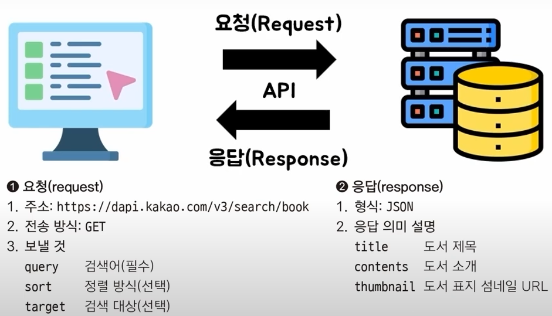

## 1. API
1.1. 개요.
* API, Application Programming Interface는 소프트웨어 애플리케이션 간 상호 작용을 가능하게 하는 인터페이스로, API는 프로그램이나 서비스가 다른 프로그램의 기능을 사용할 수 있도록 규칙과 명령어를 정의해, 서로 다른 시스템이 데이터와 기능을 공유할 수 있게 함.
* 앱이 프로그래밍 언어로 상호작용할 때의 규칙

1.2. API 가이드 요청과 응답의 규칙

* 요청과 응답 규칙(API 가이드)에 맞춰서 API를 사용한다.
* 요청
> * __주소__: 벡엔드 주소에 대한 정보
> * __전송방식__: GET(URL에 넣어서), POST(별도의 안보이는 공간에 넣어서)
* 응답
> * __형식__: JSON(대부분 JSON 사용)

 

1.3 주요 개념
* __인터페이스(Interface)__: 상호간에 소통을 위해 만들어진 접점으로, 한 프로그램이 다른 프로그램의 기능이나 데이터를 사용할 수 있도록 규칙과 프로토콜을 제공하는 것.
* __앤드포인트(Endpoint)__: API가 제공하는 특정 기능에 접근하기 위한 URL로, 예를 들어, 사용자 정보를 가져오는 엔드포인트는 `https://api.example.com/users`와 같은 형태를 가질 수 있음.
* __요청(Request)와 응답(Response)__: API는 클라이언트와 서버 간 통신을 통해 작동. 클라이언트가 서버에 요청을 보내면, 서버는 해당 요청을 처리하고 응답을 반환함. 요청은 주로 HTTP 메소드 (GET, POST, PUT, DELETE 등)를 사용하여 이루어지며, 응답은 요청에 대한 결과를 포함.
* __API의 구조__
> * __요청__: 프론트엔드(화면)에서 정보를 요청을 보낸다.
> * __응답__: 백엔드(데이터처리)에서 정보 처리 및 결과를 도출해 응답을 보낸다.
> * __데이터 포맷__: API는 주로 JSON(JavaScript Object Notation)이나 XML(eXtensible Markup Language) 형식으로 데이터를 주고받음. JSON은 가볍고 읽기 쉬운 구조로 인해 널리 사용됨.

 

1.4 API의 활용 예시
* __소셜 미디어 통합__: 애플리케이션에서 페이스북이나 트위터의 API를 사용하여 사용자 프로필 정보나 게시물을 가져오거나, 새로운 콘텐츠를 게시할 수 있습니다.
* __지도 서비스__: 구글 지도 API를 활용하여 애플리케이션 내 지도를 표시하고, 경로 안내나 장소 검색 기능 구현 가능
* __결제 시스템__: 페이팔이나 스트라이프와 같은 결제 서비스의 API를 통해 애플리케이션에 결제 기능을 통합할 수 있음.

 

1.5 API의 장점
* __재사용성__: 한 번 개발된 기능을 여러 애플리케이션에서 재사용할 수 있어 개발 효율이 높아짐.
* __유연성__: 다양한 플랫폼과 언어에서 API를 활용하여 기능을 구현할 수 있음.
* __보안성__: API를 통해 데이터 접근을 제어하고, 인증 및 권한 관리를 통해 보안을 강화할 수 있음.

 
 

## 2. 통신 프로토콜 및 아키텍처 스카일에 따른 API
2.1. HTTP API
* HTTP(HyperText Transfer Protocol)를 기반으로 애플리케이션 간 데이터를 주고받는 인터페이스로, 웹의 기본 프로토콜인 HTTP를 사용하여 클라이언트와 서버 간 통신을 수행.
* 특징
> * __프로토콜 기반__: HTTP의 표준 메서드(GET, POST, PUT, DELETE 등)를 활용하여 자원에 대한 다양한 작업 수행
> * __URI를 통한 자원 식별__: 각 자원은 고유한 URI를 통해 식별되며, 이를 통해 특정 자원에 접근하거나 조작 가능.
> * __다양한 데이터 형식 지원__: JSON, XML, HTML 등 다양한 형식의 데이터를 주고받을 수 있어서 유연성이 높음.
* 장점
> * __광범위한 호환성__: HTTP는 웹의 기본 프로토콜이므로, 다양한 플랫폼과 언어에서 쉽게 구현하고 사용할 수 있음.
> * __방화벽 친화적__: HTTP는 일반적으로 방화벽에서 허용되므로, 네트워크 제약이 있는 환경에서도 활용하기 용이함.
> * __캐싱 기능 활용__: HTTP의 캐싱 메커니즘을 통해 응답 데이터를 효율적으로 관리하고, 성능을 향상시킬 수 있음.
* 단점
> * __보안 이슈__: HTTP는 기본적으로 암호화되지 않으므로, HTTPS를 사용하여 보안을 강화해야 함.
>> * HTTPS를 사용하여 데이터 전송을 암호화하여 보안을 강화할 수 있고, 인증 및 권한 부여 메커니즘을 통해 보안 수준을 높일 수 있음.
> * __상태 비저장__: 각 요청이 독립적으로 처리되므로, 상태를 유지해야 하는 애플리케이션에서는 추가적인 구현이 필요
>> * HTTP의 무상태성은 서버의 확장성과 단순성을 높이는 장점이 있으나, 상태를 유지해야 하는 애플리케이션에서는 세션 관리나 토큰 기반 인증 등의 추가적인 구현 필요.

 

2.2. REST API (Representational State Transfer)
* 웹 서비스 설계의 아키텍처 스타일 중 하나로 HTTP 프로토콜을 기반으로, 자원(Resource)을 URI로 식별하고, HTTP 메서드를 통해 자원에 대한 CRUD(Create, Read, Update, Delete) 작업 수행
* 특징
> * __무상태성(Stateless)__: 서버는 클라이언트 상태를 저장하지 않으며, 각 요청은 독립적으로 처리됨.
> * __캐시 처리 가능(Cacheable)__: 응답 데이터는 캐시가 가능해야 하며, 이를 통해 클라이언트는 서버와의 트래픽을 줄이고 성능 향상 가능.
> * __계층화 시스템(Layerd System)__: 클라이언트는 중간 서버(프록시, 게이트웨이 등)을 통해 서버에 접근할 수 있으며, 각 계층은 독립적으로 동작
* 장점
> * __단순하고 직관적인 설계__: HTTP 프로토콜을 기반으로 하여 이해와 구현이 용이
> * __캐싱을 통한 성능 향상__: HTTP의 캐싱 기능을 활용하여 응답 속도를 높일 수 있음.
> * __유연성과 확장성__: 다양한 데이터 형식을 지원하며, 시스템 확장에 유리
* 단점
> * __복잡한 데이터 처리의 한계__: 복잡한 관계의 데이터를 처리할 때 여러 번의 요청이 필요하여 비효율적일 수 있음.
> * __표준의 부재__: 명확한 표준이 없어 구현 방식에 따라 일관성이 떨어질 수 있음.
>> * 아키텍처 스타일로서 명확한 표준이 없으나, 이를 보완하기 위해 OpenAPI 같은 명세를 활용하여 API의 일관성과 문서화를 강화할 수 있음.
> * __오버페칭(over-fetching) 문제__: 클라이언트가 필요로 하는 데이터보다 더 많은 데이터를 수신하는 문제
> * __언더페칭(under-fetching) 문제__: 복잡한 데이터 구조 처리 시, 여러 엔드포인트를 호출해야 할 수 있음.
>> * 오버페칭 및 언더페칭 문제 해결을 위해 GraphQL과 같은 대안적인 API 설계 고려 가능.

 

2.3. SOAP API (Simple Object Access Protocol)
* XML 기반의 메시지 프로토콜로, HTTP, SMTP 등 다양한 프로토콜을 통해 통신할 수 있음.
* 특징
> * __염격한 표준과 규격__: XML 기반의 메시지 프로토콜로, 정해진 스펙에 따라 메시지 구조와 처리 방식을 정의하여 상호 운용성이 높음
> * __보안성과 신뢰성__: WS-Security와 같은 표준을 통해 보안 기능을 제공하며, 트랜잭션 관리 등 신뢰성이 요구되는 환경에 적합.
> * __복잡한 메시지 구조__: XML을 사용하여 메시지 구조가 복잡하고 무거워 성능이 저하될 수 있음.
> * __상태 유지(stateful)와 상태 비저장(stateless) 통신 모두 지원__: SOAP는 상태를 유지하거나 비저장 상태로 통신할 수 있어, 다양한 요구사항에 대응 가능.
* 장점
> * __높은 보안성과 신뢰성__: WS-Security와 같은 표준을 통해 보안 기능을 제공하며, 트랜잭션 관리 등 신뢰성이 요구되는 환경에 적합
> * __표준화된 프로토콜__: 엄격한 표준과 규격을 따르므로, 상호 운용성이 높음.
> * __다양한 프로토콜 지원__: HTTP뿐만 아니라 SMTP 등 다양한 프로토콜을 통해 통신 가능.
> * 보안성과 신뢰성이 높아 금융, 통신 등 보안이 중요한 분야에서 사용.
* 단점
> * __복잡한 메시지 구조__: XML을 사용하여 메시지 구조가 복잡하고 무거워 성능이 저하될 수 있음. XML 형식만을 사용하여 데이터 처리가 비효율적일 수 있음.
>> * 이를 보완하기 위해 메시지 크기를 최적화하거나, 필요한 경우 RESTful API와 같은 대안 고려 가능
> * __구현의 복잡성__: 엄격한 스펙으로 인해 구현과 유지보수가 어려움.
>> * 이를 해결하기 위해 WSDL(Web Service Description Language) 같은 도구를 활용해 서비스 정의를 자동화하고, 개발 프레임워크를 통해 복잡성을 줄일 수 있음.

 

2.4. GraphQL API
* 페이스북에서 개발한 데이터 쿼리 언어로, 클라이언트가 필요한 데이터의 구조를 쿼리로 정의하여 요청할 수 있음.
* 특징
> * __단일 엔드포인트__: 모든 요청을 단일 엔드포인트를 통해 처리하여 관리가 용이.
> * __강력한 타입시스템__: 스키마를 통해 데이터 구조를 명확하게 정의하여, 클라이언트와 서버 간 계약을 명확히 함.
> * __오버패칭과 언더페칭 해결__: 클라이언트가 필요한 데이터만 선택적으로 요청할 수 있어 효율적인 데이터 전송 가능
* 장점
> * __효율적인 데이터 페칭__: 클라이언트가 필요한 데이터만 선택적으로 요청할 수 있어 오버페칭과 언더페칭 문제를 해결한 효율적인 데이터 전송이 가능
> * __단일 엔드포인트__: 모든 요청을 단일 엔드포인트를 통해 처리하여 관리가 용이함.
> * __강력한 타입 시스템__: 스키마를 통해 데이터 구조를 명확하게 정의하여, 클라이언트와 서버 간 계약을 명확히 함.
> * __유연성__: 클라이언트가 필요한 데이터만 선택적으로 요청할 수 있어 유연성이 높음.
* 단점
> * __복잡한 쿼리 처리__: 서버 측에서 복잡한 쿼리를 처리할 때 성능 이슈가 발생할 수 있음
>> * 쿼리 복잡성을 제한하거나 최적화 전략을 도입해 성능 개선 가능
> * __캐싱의 어려움__: REST에 비해 캐싱 구현이 복잡하여, 성능 최적화에 추가적인 노력이 필요.
>> * GraphQL의 유연성으로 인해 캐싱이 복잡할 수 있으므로, 캐싱 전략을 신중하게 설계하고, 필요한 경우 캐싱 라이브러리나 도구를 활용하여 성능 최적화 가능
> * __학습 곡선__: 기존 RESTful API에 익숙한 개발자에게는 새로운 학습 필요

| 특성 | REST API | SOAP API | GraphQL API |
|----|----|----|----|
|데이터 형식|주로 JSON, XML 등 다양한 형식 지원|XML 형식 사용|JSON 형식 사용|
|보안|HTTPS를 통한 전송 보안|WS-Security를 통한 높은 보안 수준|HTTPS를 통한 전송 보안|
|유연성|고정된 엔드포인트와 데이터 구조|엄격한 표준과 규격으로 유연성 낮음|클라이언트가 데이터 구조를 정의하여 높은 유연성|
|성능|경량 프로토콜로 비교적 우수|무거운 메시지 구조로 성능 저하 가능|복잡한 쿼리 처리 시 성능 이슈 발생 가능|

 
 

## 3. REST API (Representational State Transfer)
* 웹 서비스 설계의 아키텍처 스타일 중 하나로, RESTful API는 HTTP 프로토콜을 기반으로 자원(Resource)을 URL로 식별하고, HTTP 메서드(GET, POST, PUT, DELETE 등)를 통해 자원에 대한 CRUD(Create, Read, Update, Delete) 작업을 수행

 

3.1. REST의 주요 구성 요소
* __자원(Resource)__: 웹에서 식별 가능한 모든 것을 자원이라고 함. 예를 들어, 사용자 정보, 이미지, 동영상 등이 자원에 해당
* __URI(Uniform Resource Identifier)__: 각 자원을 고유하게 식별하는 주소, 예를 들어, `https://api.example.com/users/123`는 ID가 123인 사용자를 식별하는 URI임.
* __HTTP 메서드__: 자원에 대한 행위를 정의하는 메서드로 주요 메서드는 다음과 같음.
> * __GET__: 자원의 조회
> * __POST__: 자원의 생성
> * __PUT__: 자원의 전체 수정
> * __PATCH__: 자원의 부분 수정
> * __DELETE__: 자원의 삭제
* __표현(Representation)__: 자원의 상태나 정보를 전달하는 방식으로, 주로 JSON이나 XML 형식이 사용됨

 

3.2.	REST의 6가지 원칙
* __클라이언트-서버 구조(Client-Server Architecture)__: 클라이언트와 서버의 역할을 명확히 분리하여, 클라이언트는 사용자 인터페이스를 담당하고, 서버는 데이터 저장 및 처리 담당.
* __무상태성(Statelessness)__: 서버는 클라이언트의 상태를 저장하지 않으며, 각 요청은 독립적으로 처리. 즉, 요청 간 세션 정보가 유지되지 않음.
* __캐시처리 가능(Cacheability)__: 응답 데이터는 캐시가 가능해야 하며, 이를 통해 클라이언트는 서버와의 트래픽을 줄이고 성능을 향상시킬 수 있음.
* __계층화 시스템(Layered System)__: 클라이언트는 중간 서버(프록시, 게이트웨이 등)를 통해 서버에 접근할 수 있으며, 각 계층은 독립적으로 동작함.
* __코드 온 디맨드(Code on Demand, 선택 사항)__: 서버는 클라이언트에게 실행 가능한 코드를 전송하여 기능을 확장할 수 있음. 예를 들어, 자바스크립트 코드를 전송하여 클라이언트에서 실행하게 할 수 있음.
* __균일한 인터페이스(Uniform Interface)__: 일관된 인터페이스를 통해 시스템의 아키텍처를 단순화하고, 각 부분이 독립적으로 개선될 수 있도록 함.

 

3.3.	RESTful API 설계 시 고려사항
* __명확한 URI 설계__: 자원을 명확하게 식별할 수 있도록 직관적인 URI를 설계해야 함. 예를 들어 `/users`는 사용자 목록을, `/users/123`은 특정 사용자를 나타냄.
* __적절한 HTTP 메서드 사용__: 자원에 대한 행위에 맞는 HTTP 메서드를 사용해야 함. 예를 들어, 데이터 조회 시 GET, 생성할 때는 POST를 사용
* __상태 코드 활용__: HTTP 상태 코드를 활용하여 요청의 결과를 명확하게 전달해야 함. 예를 들어, 성공적인 요청은 200 OK, 리소스를 찾을 수 없을 때는 404 Not Found를 반환함.
* __표현 형식 지정__: 클라이언트와 서버 간 데이터 교환 형식을 명확히 지정해야 함. 주로 JSON 형식을 사용하며, `Content-Type` 헤더를 통해 이를 명시.

 
 

## 4. 접근 범위, 통신 방식, 사용 목적에 따른 분류
4.1. 접근 범위에 따른 분류
* __Private API__: 조직 내부에서만 사용되는 API로 외부에 공개되지 않음. 주로 내부 시스템 간 통신이나 기능 연동에 활용
* __Partner API__: 특정 비즈니스 파트너와 공유되는 API로, 제한된 외부 사용자에게만 접근 권한이 부여 됨. 예를 들어, 특정 협력사와의 데이터 연동을 위해 사용
* __Public API (Open API)__: 모든 개발자나 사용자가 접근할 수 있도록 공개된 API로, 외부 개발자들이 해당 API를 활용하여 애플리케이션을 개발할 수 있음. 예를 들어, 구글 지도 API나 트위터 API 등이 있음.
> *	기능을 만들어 놓은 벡엔드를 API를 통해서 공개해둔 것
> *	공개된 API를 정리한 github: https://github.com/public-apis/public-apis
* __비교__: REST, SOAP, GraphQL API는 모두 접근 범위에 따라 Private, Partner, Public API로 구현될 수 있음. 즉, 특정 프로토콜이나 아키텍처 스타일이 접근 범위를 결정하는 것은 아니며, API의 공개 수준은 비즈니스 요구사항에 따라 결정됨.

 

4.2. 통신 방식에 따른 분류
* __RPC API (Remote Procedure Call)__: 원격 시스템의 함수를 호출하는 방식으로, 주로 내부 시스템 간 통신에 사용. RPC는 프로토콜에 따라 JSON-RPC, XML-RPC 등으로 나뉨.
* __WebSocket API__: 클라이언트와 서버 간 양방향 통신을 지원하는 API로, 실시간 데이터 전송이 필요한 애플리케이션에서 사용. 예를 들어, 채팅 애플리케이션이나 실시간 주식 거래 시스템 등이 있습니다.
* __비교__
> *	__REST API__: HTTP 프로토콜을 기반으로, 주로 요청-응답 방식의 통신 사용. 상태 비저장(stateless) 아키텍처로, 각 요청은 독립적으로 처리됨.
> *	__SOAP API__: XML 기반 메시지 프로토콜로, HTTP, SMTP 등 다양한 프로토콜을 통해 통신할 수 있음. 상태 유지(stateful)와 상태 비저장(stateless) 통신을 모두 지원
> *	__GraphQL API__: HTTP 프로토콜을 통해 주로 POST 요청을 사용하여 통신하며, 클라이언트가 필요한 데이터의 구조를 쿼리로 정의하여 요청할 수 있음.

 

4.3. 사용 목적에 따른 분류
* __웹 API__: 웹 기반 애플리케이션을 위한 API로, HTTP 프로토콜을 통해 통신. REST API, SOAP API 등이 이에 해당
* __라이브러리/프레임워크 API__: 프로그래밍 언어나 프레임워크에서 제공하는 API로, 개발자가 특정 기능을 구현할 때 활용. 예를 들어, Java의 표준 라이브러리 API나 iOS의 UIKit 등이 있음.
* __운영체제 API__: 운영체제에서 제공하는 API로, 애플리케이션이 시스템 자원이나 기능에 접근할 수 있도록 함. 예를 들어, Windows API나 Android API 등이 있음.
* __비교__: REST, SOAP, GraphQL API는 주로 웹 API로 분류되며, 웹 기반 애플리케이션 간 통신을 위해 사용됨. 반면, 라이브러리/프레임워크 API나 운영체제 API는 특정 언어나 플랫폼 내에서 제공되는 기능을 활용하기 위한 인터페이스로, 웹 기반 통신과는 목적과 사용 방식이 다름.

